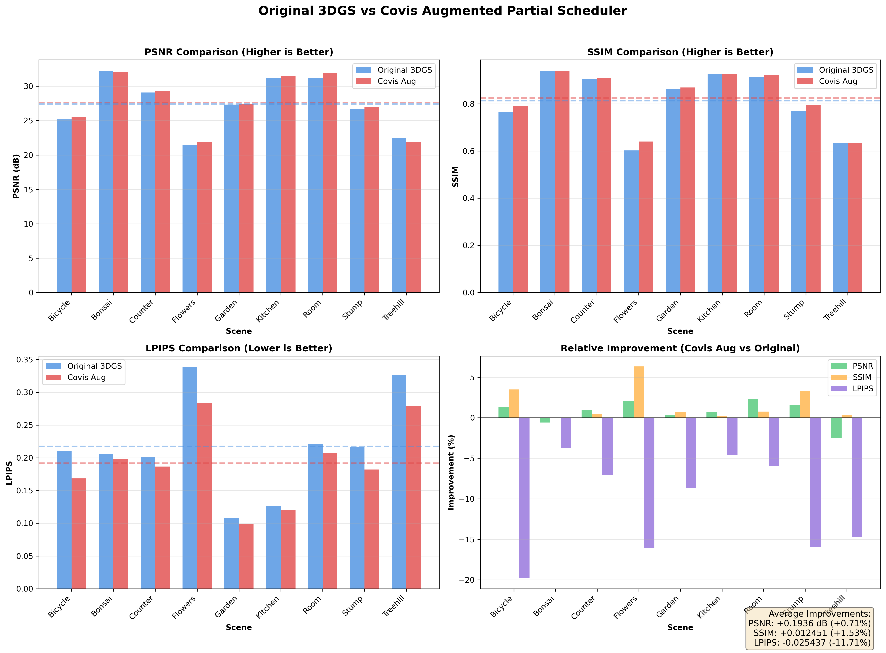

# CAB-GS: SfM Point Augmentation with Scene Co-visibility-based Image Batching for Sharper 3D Gaussian Splatting

Official implementation of "SfM Point Augmentation with Scene Co-visibility-based Image Batching for Sharper 3D Gaussian Splatting"

## Overview

This repository introduces a novel approach to enhance 3D Gaussian Splatting through two key innovations:

1. **SfM Point Augmentation**: A quadtree-based point augmentation strategy that densifies sparse SfM point clouds by leveraging multi-view geometric consistency and scene co-visibility information.

2. **Co-visibility-based Image Batching**: An adaptive training scheduler that groups and processes images based on their co-visibility relationships, enabling more effective optimization of Gaussian primitives.

## Key Improvements

- **Enhanced Point Cloud Initialization**: Augments sparse SfM reconstructions with geometrically consistent points in under-reconstructed regions
- **Co-visibility-aware Training**: Groups cameras by scene co-visibility to improve convergence and representation quality
- **Partial Scheduler**: Adaptive training schedule that optimizes different scene regions progressively
- **Additional Loss Terms**: Depth smoothness and Laplacian pyramid losses for improved geometric consistency

## Results

Our method achieves improved reconstruction quality, particularly in challenging regions with sparse initial point clouds:



## Installation

### Requirements

- CUDA-capable GPU
- Python 3.8+
- CUDA 11.8+

### Setup

```bash
# Clone the repository
git clone https://github.com/sonbosung/CAB-gaussian-splatting.git
cd CAB-gaussian-splatting

# Create conda environment
conda env create -f environment.yml
conda activate cab_gs

# Install submodules (original 3D Gaussian Splatting dependencies)
git submodule update --init --recursive
```

## Usage

### Quick Start

```bash
# Step 1: Augment SfM point cloud
python augment.py \
    --colmap_path <path_to_colmap>/sparse/0 \
    --image_path <path_to_images> \
    --augment_path <output_path>/sparse/0/points3D.bin \
    --camera_order covisibility \
    --visibility_aware_culling \
    --compare_center_patch \
    --n_clusters 4

# Step 2: Train with co-visibility-based batching
python train_partialscheduler.py \
    -s <path_to_augmented_data> \
    -m <output_model_path> \
    --eval \
    --bundle_training \
    --camera_order covisibility \
    --enable_ds_lap \
    --lambda_ds 1.2 \
    --lambda_lap 0.4 \
    --n_clusters 4

# Step 3: Render test views
python render.py -m <output_model_path> --skip_train

# Step 4: Compute metrics
python metrics.py -m <output_model_path>
```

### Full Evaluation Pipeline

For reproducing results on Mip-NeRF 360 dataset:

```bash
bash eval_covis_augment_partialscheduler.sh
```

Edit the script to set your dataset and output paths.

## Method Details

### Point Augmentation

The augmentation process uses quadtree decomposition to identify under-reconstructed image regions and generates new 3D points through:
- Multi-view depth interpolation
- Geometric consistency verification across co-visible views
- Local texture comparison for filtering occluded points

### Co-visibility-based Training

The training scheduler:
1. Builds a co-visibility graph from SfM reconstruction
2. Clusters cameras into groups based on shared visibility
3. Progressively trains on camera groups during densification
4. Applies adaptive densification and pruning per group

See [TRAINING.md](docs/TRAINING.md) for detailed parameter descriptions.

## Citation

If you find this work useful, please cite:

```bibtex
@article{sonn2025cab,
  title={SfM Point Augmentation with Scene Co-visibility-based Image Batching for Sharper 3D Gaussian Splatting},
  author={Sonn, Bosung},
  journal={arXiv preprint},
  year={2025}
}
```

And the original 3D Gaussian Splatting:

```bibtex
@article{kerbl3Dgaussians,
  author       = {Kerbl, Bernhard and Kopanas, Georgios and Leimk{\"u}hler, Thomas and Drettakis, George},
  title        = {3D Gaussian Splatting for Real-Time Radiance Field Rendering},
  journal      = {ACM Transactions on Graphics},
  number       = {4},
  volume       = {42},
  year         = {2023},
  url          = {https://repo-sam.inria.fr/fungraph/3d-gaussian-splatting/}
}
```

## Acknowledgments

This work builds upon the excellent [3D Gaussian Splatting](https://github.com/graphdeco-inria/gaussian-splatting) implementation by Kerbl et al. We gratefully acknowledge their contribution to the community.

Our modifications focus on:
- SfM point augmentation strategy
- Co-visibility-based camera grouping and training scheduling
- Additional geometric consistency losses

## License

This work is a derivative of 3D Gaussian Splatting and is licensed under the same terms for research and evaluation purposes only. See [LICENSE.md](LICENSE.md) for details.

Commercial use requires explicit permission from the original authors.

## Contact

For questions or issues, please contact:
- Bosung Sonn: sonbosung@kakao.com
- Or open an issue on GitHub

## Project Status

🚧 Paper in preparation - Code and full documentation coming soon!
